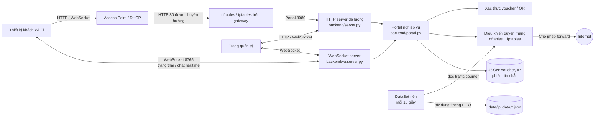

# ACDV WiFi Captive Portal

> Hệ thống captive portal cho mạng Wi-Fi ACDV: xác thực khách bằng voucher thời lượng hoặc dung lượng, theo dõi phiên sử dụng và tự động cấp/thu hồi quyền truy cập Internet.

## Tổng quan

Ứng dụng chạy trên máy Linux làm gateway/portal. Người dùng kết nối Wi-Fi, mở trang portal và nhập mã voucher hoặc quét QR. Backend xác thực voucher, lưu trạng thái, sau đó thêm hoặc xóa địa chỉ IP của thiết bị trong bộ quy tắc mạng. Trang admin quản lý voucher, thiết bị đang hoạt động, thống kê sử dụng và trao đổi tin nhắn với khách.

### Sơ đồ khối



### Luồng cấp quyền truy cập

```mermaid
sequenceDiagram
    participant K as Khách Wi-Fi
    participant G as Gateway / firewall
    participant S as ACDV Portal
    participant D as JSON store
    K->>G: Kết nối mạng và mở trang web
    G->>S: Chuyển hướng HTTP tới portal
    K->>S: Gửi voucher hoặc yêu cầu kích hoạt QR
    S->>D: Kiểm tra voucher, ghi trạng thái phiên
    S->>G: Thêm IP vào nftables/iptables
    G-->>K: Cho phép truy cập Internet
    loop Theo dõi gói data
        S->>G: Đọc bộ đếm lưu lượng
        S->>D: Cập nhật dung lượng; hết hạn thì thu hồi IP
    end
```

## Tính năng

- Voucher theo **thời lượng** hoặc **dung lượng**; danh mục và giá gói được định nghĩa trong `backend/config.py`.
- Trang khách: nhập voucher, xem trạng thái kết nối/thời gian/dung lượng còn lại, kích hoạt QR và chat với admin.
- Trang admin: đăng nhập, tạo và thu hồi voucher/quyền truy cập, xem thiết bị và báo cáo sử dụng, gửi voucher cho thiết bị.
- Voucher QR có token dùng một lần và thời hạn; token được lưu dưới dạng hash.
- WebSocket đẩy trạng thái và tin nhắn realtime; HTTP vẫn phục vụ trang web và API.
- Bot nền đo lưu lượng theo delta, phân bổ data FIFO; IP bị ngắt khi mọi gói data đã hết.
- Tự đồng bộ danh sách IP đang hoạt động với nftables sau khi ứng dụng khởi động.
- Giới hạn tốc độ request theo IP; khi vượt ngưỡng trả HTTP `429` và `Retry-After`.

## Công nghệ

- Python: HTTP server tích hợp `http.server`, xử lý đồng thời bằng thread.
- WebSocket: thư viện `websockets`.
- QR: `qrcode[pil]`.
- Giao diện: HTML, CSS, JavaScript tĩnh trong `frontend/static/`.
- Mạng: Linux, nftables và iptables; dữ liệu lưu bằng JSON, không cần dịch vụ cơ sở dữ liệu riêng.

## Yêu cầu triển khai

- Linux gateway có Python 3, `sudo`, `nft`, `iptables`, `ip`, `ping` và quyền đọc thông tin DHCP/ARP cần thiết.
- Gateway, Access Point, DHCP, định tuyến/NAT và firewall phải được cấu hình phù hợp với mạng thực tế. Ứng dụng **không tự cấu hình toàn bộ router, DHCP, Wi-Fi hoặc luật chuyển hướng ban đầu**.
- Firewall phải chuyển hướng request captive portal đến HTTP server, cho phép kết nối WebSocket, và chỉ forward Internet cho các IP đã được cấp quyền.
- Mặc định HTTP server nghe cổng `8080`; WebSocket nghe cổng `8765`. Mã nguồn đang dùng portal IP `10.10.10.1`, table/set nftables `inet quy-tac-mang danh_sach_v4`, interface giám sát `eth0` và file DHCP `/var/lib/dhcp/dhcpd.leases`. Cần đối chiếu và chỉnh theo máy triển khai trong `backend/config.py` và ruleset thực tế.
- Các tên interface, địa chỉ gateway, file lease và luật chuyển hướng khác nhau theo môi trường. Kiểm tra kỹ trước khi áp dụng; không sao chép ruleset mẫu từ máy khác một cách máy móc.

## Cài đặt và chạy

### 1. Lấy mã nguồn

```bash
git clone <URL_REPOSITORY>
cd <THU_MUC_DU_AN>
```

### 2. Cấu hình mật khẩu

Tạo file `.env` tại thư mục gốc dự án:

```dotenv
ACDV_ADMIN_PASSWORD=thay-bang-mat-khau-quan-tri-manh
ACDV_SUDO_PASSWORD=
```

- `ACDV_ADMIN_PASSWORD`: bắt buộc để đăng nhập trang admin; nếu bỏ trống, đăng nhập admin bị từ chối.
- `ACDV_SUDO_PASSWORD`: tùy chọn theo cấu hình sudo của máy. Ứng dụng dùng `sudo -S` khi gọi nftables/iptables và đọc traffic counter. Không đặt mật khẩu thật trong README, source code hoặc Git.
- `main.py` tự nạp `.env`; biến môi trường đã có sẵn được ưu tiên hơn giá trị trong file.

### 3. Khởi chạy

Script tạo `.venv`, cài các package trong `requirements.txt` rồi chạy ứng dụng:

```bash
chmod +x run.sh
./run.sh
```

Hoặc dùng môi trường Python đã được chuẩn bị:

```bash
python3 -m pip install -r requirements.txt
python3 main.py
```

Các trang mặc định:

- Khách: `http://<IP_GATEWAY>:8080/user`
- Admin: `http://<IP_GATEWAY>:8080/admin`
- WebSocket: cổng `8765` (được frontend sử dụng cho cập nhật realtime).

Nếu captive redirect ngoài mạng chuyển cổng 80 về cổng 8080 thì khách có thể được đưa tới portal tự động. Trình duyệt hiện đại thường hạn chế captive portal qua HTTPS; kiểm thử trên thiết bị/mạng đích trước khi vận hành.

### 4. Chạy cùng systemd (tùy chọn)

Unit mẫu nằm trong `systemd/acdv-portal.service`; cần sửa `User`, `Group`, `WorkingDirectory` và `ExecStart` cho đúng vị trí cài đặt trước khi cài. Script cài đặt cần quyền quản trị:

```bash
sudo bash systemd/install_service.sh
sudo systemctl status acdv-portal
sudo journalctl -u acdv-portal -f
```

Ứng dụng vẫn cần quyền phù hợp để chạy các lệnh mạng qua sudo. Trên máy chủ production, nên dùng tài khoản dịch vụ riêng và chính sách sudo giới hạn đúng lệnh cần thiết thay vì cấp quyền rộng.

## Dữ liệu và cách tính dung lượng

- `acdv_data.json`: voucher, IP active, mapping thiết bị, QR/pending activation và một phần trạng thái chat.
- `acdv_chat.json`: kho tin nhắn chat riêng (nếu được sử dụng bởi chat store).
- `data/ip_data/<IP>.json`: packages, giao dịch, counter traffic và mức sử dụng của từng IP.
- Mỗi voucher data được quản lý như package riêng. Traffic mới được trừ theo FIFO; khi nạp thêm package, dung lượng mới bắt đầu với mức đã dùng bằng 0.
- JSON được ghi vào đĩa cục bộ. Sao lưu các file dữ liệu trước khi nâng cấp hoặc thay đổi máy; không xóa `data/` nếu cần giữ lịch sử voucher và mức sử dụng.

## API và giao tiếp

Backend cung cấp API cho trạng thái khách, đăng nhập/quản lý admin, tạo voucher, QR, kích hoạt voucher, chat và dashboard. WebSocket dùng cổng `8765` để gửi trạng thái định kỳ và sự kiện chat/activation realtime. Các route cụ thể được xử lý trong `backend/server.py` và `backend/wsserver.py`.

## Cấu trúc thư mục

| Đường dẫn | Vai trò |
|---|---|
| `main.py` | Nạp `.env`, đồng bộ trạng thái mạng, khởi chạy các tác vụ nền và server. |
| `backend/server.py` | HTTP server, static files, API khách/admin và rate limit. |
| `backend/wsserver.py` | WebSocket server, cập nhật trạng thái và chat realtime. |
| `backend/portal.py` | Nghiệp vụ portal, voucher, phiên truy cập và trạng thái thiết bị. |
| `backend/data.py` | Đọc/ghi dữ liệu voucher và phiên JSON. |
| `backend/ip_data.py` | Package data, giao dịch và phân bổ lưu lượng FIFO theo IP. |
| `backend/data_bot2.py` | Tác vụ nền theo dõi traffic và thu hồi IP hết data. |
| `backend/nft.py`, `backend/network.py` | Tích hợp nftables/iptables và thu thập trạng thái mạng. |
| `backend/auth.py`, `backend/config.py` | Phiên admin, cấu hình cổng, mật khẩu, voucher và mạng. |
| `frontend/static/` | Giao diện khách/admin và tài nguyên tĩnh. |
| `data/ip_data/` | Dữ liệu dung lượng theo IP. |
| `systemd/` | Unit và script cài service. |
| `tests/` | Kiểm thử tính năng dữ liệu. |

## Kiểm thử

```bash
python3 -m pip install pytest
python3 -m pytest -q
```

Một số luồng mạng cần Linux gateway và nftables/iptables thật; kiểm thử đơn vị không thay thế kiểm thử tích hợp trên thiết bị/mạng triển khai.

## Bảo mật và công bố lên GitHub

- Không commit `.env`, voucher đang dùng, chat, IP khách, file dữ liệu thật, log hoặc bản sao lưu.
- File admin cookie hiện là session phía server; chỉ nên quản trị trong mạng tin cậy. Nếu truy cập qua mạng không tin cậy, đặt sau HTTPS/reverse proxy và đánh giá lại thuộc tính cookie, xác thực, phân quyền và chính sách firewall.
- `ACDV_SUDO_PASSWORD` trong `.env` là bí mật dạng văn bản thuần. Ưu tiên cấu hình sudoers tối thiểu phù hợp với vận hành và bảo vệ quyền đọc file cấu hình.
- Trước khi đưa repository lên public, rà soát toàn bộ lịch sử Git, dữ liệu mẫu và thông tin liên hệ/cấu hình nhúng; thêm `.env.example` chỉ chứa giá trị giả nếu cần.

## Giấy phép

Chưa khai báo giấy phép. Hãy bổ sung file `LICENSE` và chọn giấy phép phù hợp trước khi cho phép người khác sử dụng/phân phối mã nguồn.
